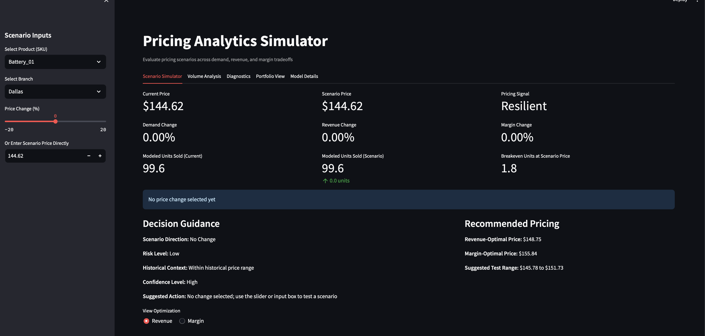
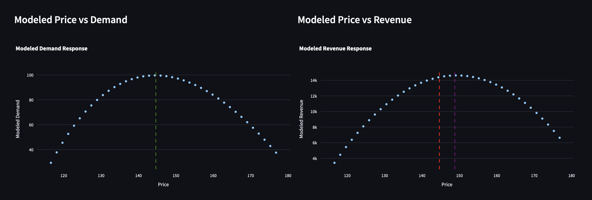
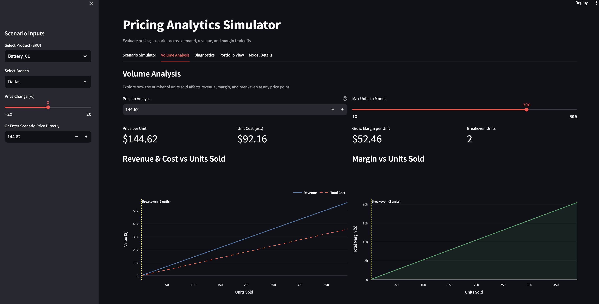
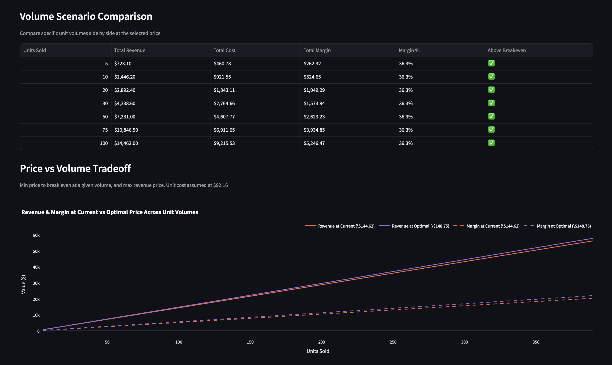
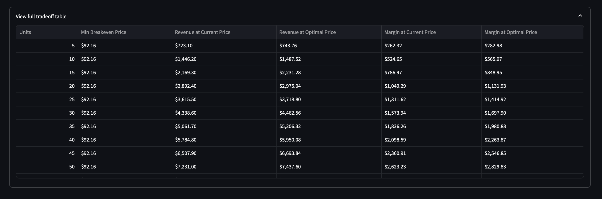
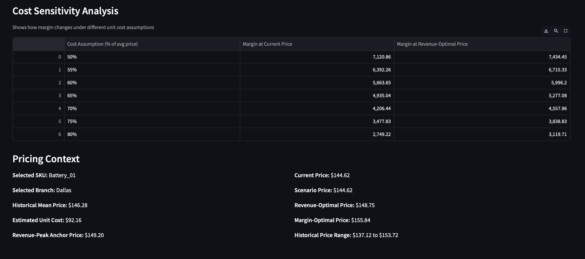
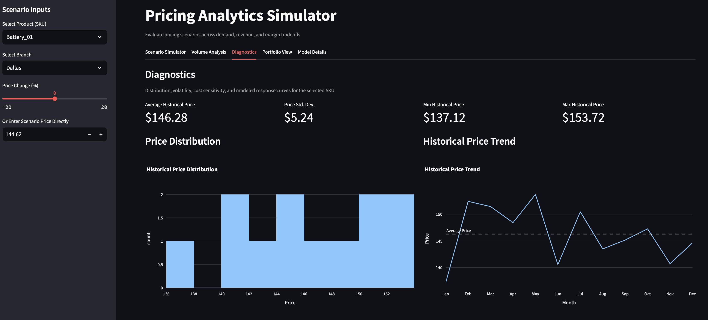
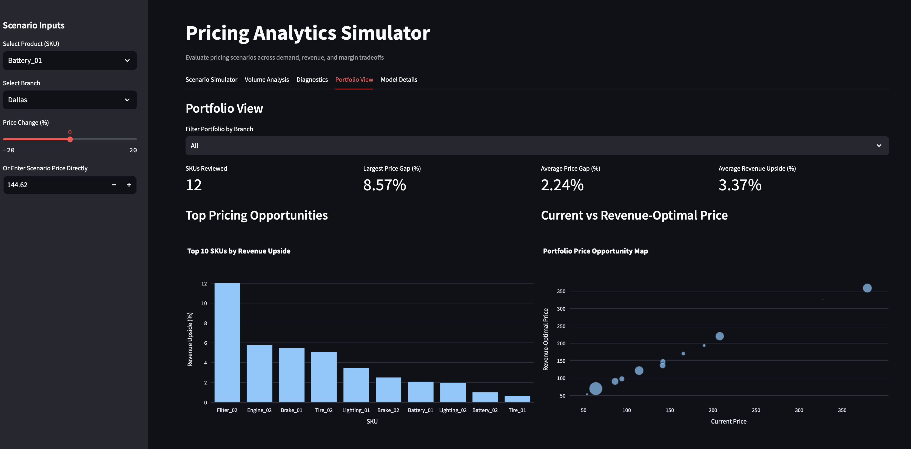
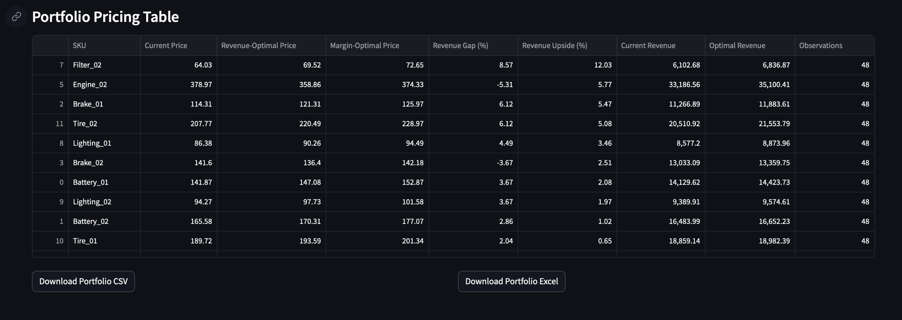

# Pricing Analytics Simulator

An interactive pricing tool that helps evaluate how price changes impact demand, revenue, and margin.

---

## Overview

Pricing decisions are often made using static rules or intuition, without fully understanding how customers respond to price changes.

This project was built to make pricing more data-driven by allowing users to simulate different scenarios and immediately see the impact on key business metrics.

It combines demand modeling, scenario testing, and portfolio-level insights into a single interface.

---

## Application Preview



---

## What This Tool Does

### Scenario Simulation


Test different pricing decisions and instantly see how they affect:

- Demand  
- Revenue  
- Margin  
- Breakeven levels  

The tool also provides a simple pricing signal (e.g., resilient vs sensitive) and basic decision guidance.

---

### Revenue & Demand Behavior




These charts show how revenue and demand respond to price changes.

Instead of assuming a straight-line relationship, the model captures more realistic patterns like diminishing returns and optimal pricing zones.

---

### Volume & Tradeoff Analysis







This section focuses on unit economics:

- How volume affects revenue and cost  
- Where breakeven occurs  
- How current pricing compares to optimal pricing  

---

### Cost Sensitivity



Shows how changes in cost assumptions impact margin.

Useful for understanding risk when input costs fluctuate.

---

### Diagnostics & Historical Context



Provides context behind the model:

- Historical pricing patterns  
- Distribution of prices  
- Basic volatility indicators  

---

### Portfolio View





Looks across multiple products to identify pricing opportunities.

Highlights:

- Which SKUs have the most upside  
- Gaps between current and optimal pricing  
- Exportable results for further analysis  

---

## Methodology

The model uses a machine learning approach (gradient boosting) to estimate how demand responds to price.

From there:
- Pricing scenarios are simulated  
- Revenue and margin are recalculated  
- Optimal price points are identified  

This allows for more flexibility than traditional price elasticity models, especially when demand patterns are not linear.

---

## Tech Stack

- Python  
- Streamlit  
- Pandas / NumPy  
- Plotly  
- Scikit-learn / XGBoost  

---

## How to Run

```bash
pip install -r requirements.txt
streamlit run app/streamlit_app.py
