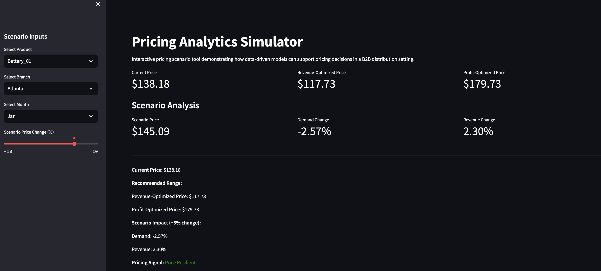
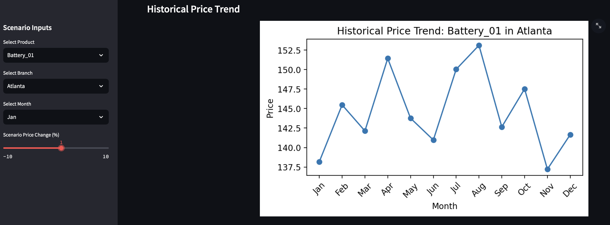
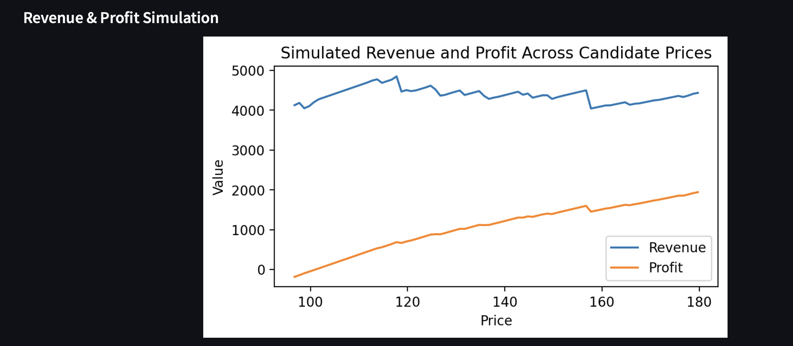

# Aftermarket-price-elasticity-modeling
Pricing analytics project analyzing price sensitivity across products in a B2B distribution setting, using statistical and machine learning models to simulate pricing scenarios and support data-driven pricing strategy decisions.
# Overview
This project presents a pricing analytics workflow designed to understand how price changes impact demand across products in a B2B distribution environment. It combines statistical modeling and machine learning to estimate price sensitivity and simulate pricing scenarios for better decision-making.

# Business Problem
In large B2B product catalogs, pricing decisions are challenging due to:
- Irregular and sparse demand patterns across SKUs  
- Differences in price sensitivity between product categories  
- Limited visibility into how price changes affect revenue and volume  

This makes it difficult to apply a consistent and data-driven pricing strategy.

# Objectives
- Estimate price sensitivity (elasticity) across products  
- Compare interpretable and machine learning models  
- Simulate the impact of price changes on demand and revenue  
- Provide insights to support structured pricing decisions  

# Data
The original project was based on confidential transactional data from a B2B distributor.  
To preserve confidentiality, this repository uses a **synthetic dataset** that reflects the structure of real-world data without exposing proprietary information.

Example fields:
- product_id  
- month  
- price  
- units_sold  
- revenue  
- product_group  

# Pricing Analytics Simulator

Interactive pricing analytics application demonstrating how data-driven models can support pricing decisions in a B2B distribution environment.

---

## Overview

This project simulates how price changes impact demand, revenue, and profit at the SKU level. It combines machine learning and scenario analysis to provide a practical decision-support tool for pricing strategy.

Designed to reflect real-world challenges such as irregular demand, SKU-level variability, and limited data visibility.

---

## Key Features

- SKU-level price sensitivity modeling  
- Interactive scenario simulation (+/- price changes)  
- Revenue and profit optimization analysis  
- Historical price trend visualization  
- Revenue vs. profit simulation curves  
- Clean dashboard built with Streamlit  

---

## Application Preview

### Dashboard


### Historical Price Trend


### Revenue & Profit Simulation


---
## Methodology

### Data
- Synthetic dataset representing SKU-level pricing across branches and months  
- Designed to mimic real B2B demand patterns  

### Modeling
- Machine learning model (XGBoost) estimates demand response  
- Features include:
  - Price
  - Category
  - Branch
  - Month  

### Optimization
- Simulates demand across candidate prices  
- Calculates:
  - Revenue = Price × Demand  
  - Profit = (Price - Cost) × Demand  
- Identifies optimal pricing points  

### Scenario Analysis
- User inputs price change (%)  
- Model predicts:
  - Demand impact  
  - Revenue impact  
- Outputs pricing signal (e.g., Price Resilient)

---

## Tech Stack

- Python  
- Pandas / NumPy  
- XGBoost  
- Scikit-learn  
- Streamlit  
- Matplotlib  

---

## How to Run

```bash
pip install -r requirements.txt
streamlit run app/streamlit_app.py
...
``` 

# Methodology

### 1. Data Preparation
- Cleaned and structured transactional data  
- Standardized time-based aggregation  
- Handled sparse demand patterns  

### 2. Modeling Approaches
- **Log-Log Regression** → interpretable price elasticity estimates  
- **Random Forest** → captures nonlinear relationships  
- **Gradient Boosting** → improved predictive performance  

### 3. Scenario Simulation
- Simulated price changes (e.g., ±1–10%)  
- Estimated impact on demand and revenue  
- Classified products by pricing behavior  

## Key Insights
- Some products are relatively **price-resilient**, with minimal demand impact  
- Others are **price-sensitive**, where price changes significantly affect volume  
- Machine learning models capture nonlinear effects missed by simple regression  
- Interpretable models remain valuable for explaining business impact  

## Business Value
This framework demonstrates how pricing teams can move from intuition-based decisions to structured, data-driven strategies. It helps identify where pricing flexibility exists and where aggressive price changes may introduce risk.

## Note
This repository is a **sanitized portfolio version** of a real-world project.  
All data, identifiers, and results have been modified or simulated to protect confidentiality.
